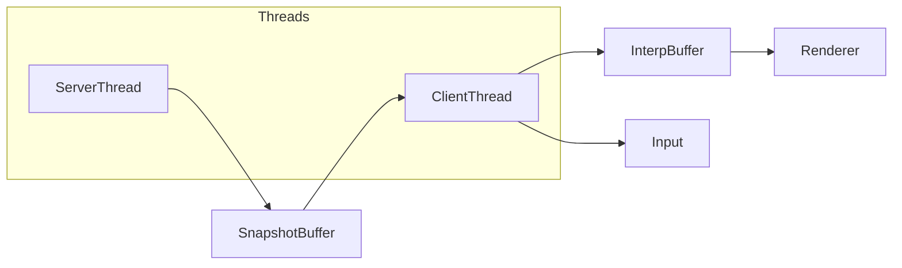
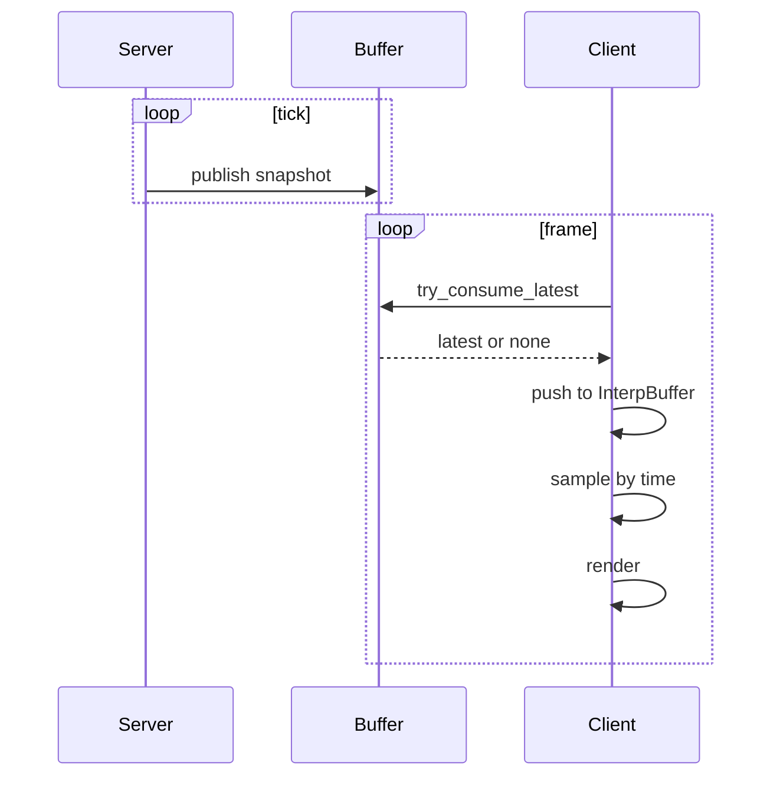

# Architecture

**Goal:** a clear, testable vertical slice for a future client–server F1 team manager.  
We co‑host client and server in one process for now, with a clean seam to split later.

## System overview

**Components**
- **SimServer**: fixed timestep simulation that advances world state and laps.
- **SnapshotBuffer**: single‑producer single‑consumer buffer. Latest wins.
- **InterpBuffer**: client‑side ring buffer keyed by `sim_time`. Samples with clamping.
- **Viewer**: raylib top‑down view, HUD, input.
- **Time warp**: atomic `time_scale` multiplies server dt. Pause with `0.0`.

## Data model

**SimSnapshot**
- `x, y`: world meters
- `heading_rad`: 0..2*pi
- `sim_time`: seconds since sim start, monotone
- `s`: arclength on track
- `lap`: completed laps
- `tick`: server tick index

**TrackCircle**
- `center_x, center_y, radius_m`

## Threading model

**Contracts**
- `SnapshotBuffer`: one writer and one reader. Overwrites old. No blocking on client.
- `InterpBuffer`: not thread‑safe; used on client only. No extrapolation, clamps to ends.
- `sim_time`: monotone per server. Snapshots are immutable after publish.

## Time

- **Server cadence**: fixed wall tick (e.g. 240 Hz).  
- **Effective dt**: `dt_eff = base_dt * time_scale`.  
- **Interpolation**: client renders slightly behind latest with `interp_delay` (default 50 ms).

## Extension points

- Replace `TrackCircle` with richer track types.
- Add fuel, tyres, pits into sim step.
- Move server out of process; keep snapshot seam.
- Add multi‑car, inputs, UI panels, overlays for SC and VSC.
