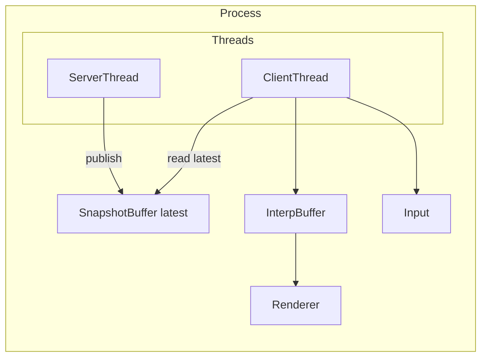
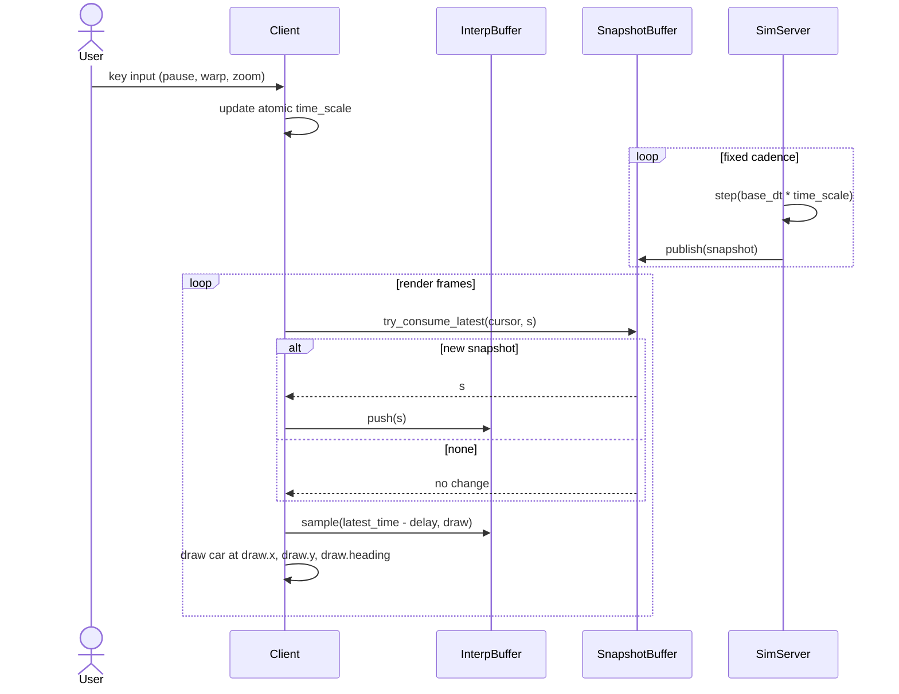
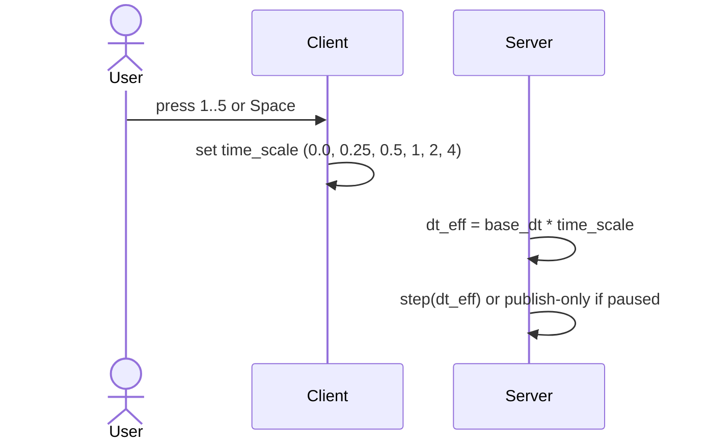
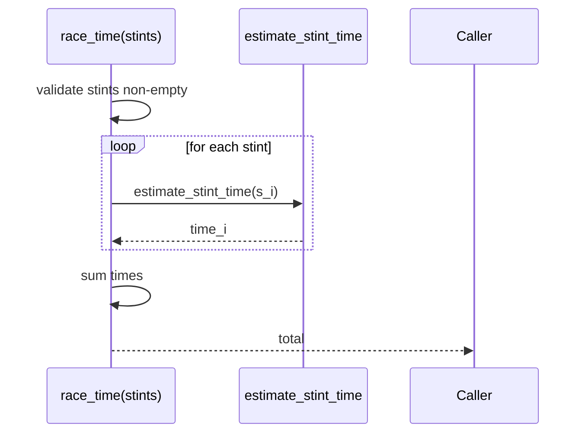
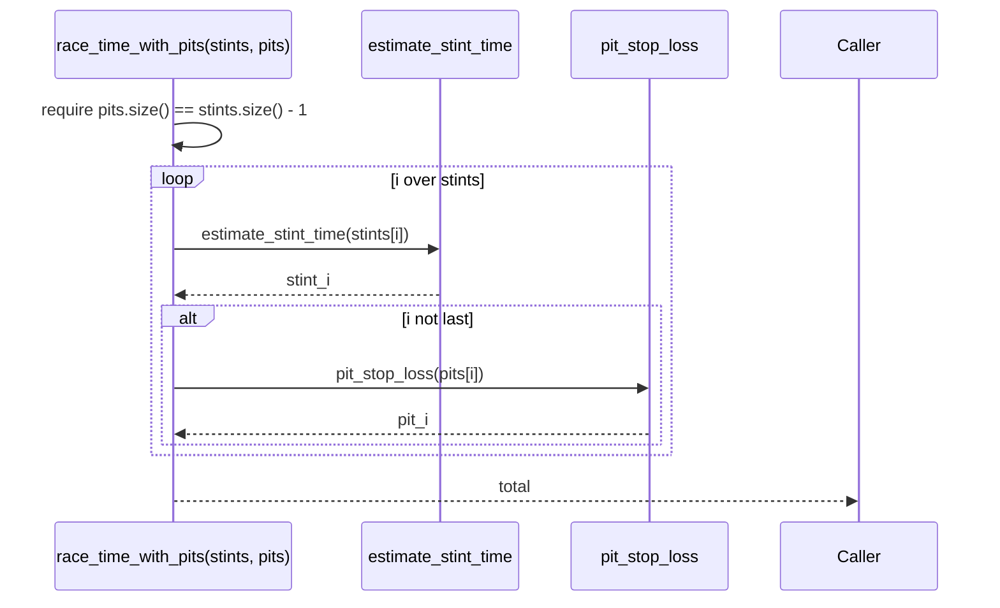
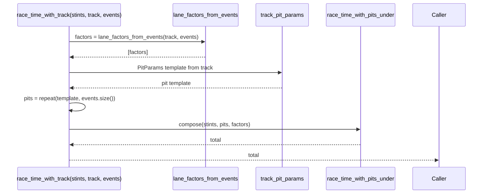
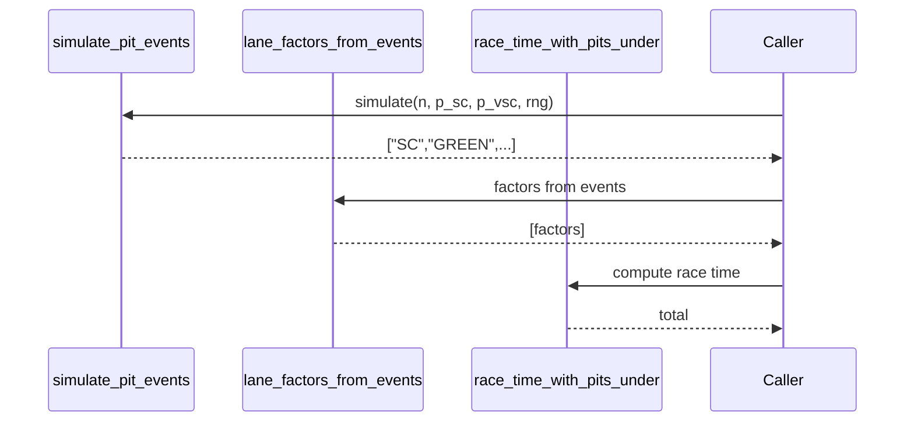
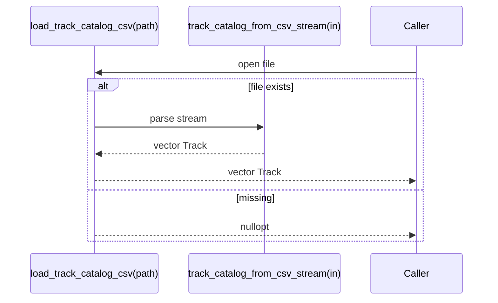

# F1Manager Technical Documentation

This document explains the current vertical slice of the F1 Team Manager project: concepts, data models, threading, and the call paths that tie it together.  
Target audience: developers and reviewers. All diagrams are **Mermaid** and render on GitHub and in VS Code.

---

## Table of Contents

1. [System Design](#system-design)  
2. [Namespaces and Modules](#namespaces-and-modules)  
3. [Data Types and Relationships](#data-types-and-relationships)  
4. [Components and APIs](#components-and-apis)  
5. [Call Paths (Sequence Diagrams)](#call-paths-sequence-diagrams)  
6. [Design Rationale](#design-rationale)  
7. [Public API Summary](#public-api-summary)  
8. [Roadmap](#roadmap)

---

## System Design



**Components**
- **SimServer**: fixed timestep simulation that advances world state and lap counting.
- **SnapshotBuffer**: single producer single consumer buffer. Latest snapshot wins; old data can be overwritten.
- **InterpBuffer**: client side ring buffer keyed by `sim_time`. Samples with clamping to avoid extrapolation.
- **Viewer**: raylib top down view, HUD, input handling.
- **Time warp**: atomic `time_scale` multiplies server dt. Pause with `0.0`.

**Key properties**
- Server is authoritative and deterministic.
- Client reads immutable snapshots and never blocks the server.
- Interpolation isolates rendering from frame jitter.

---

## Namespaces and Modules

All public APIs live in the `f1tm` namespace.

- **Core simulation**
  - `sim.hpp` — `TrackCircle`, `CarState`, `SimServer`
- **Snapshot exchange**
  - `snap.hpp` — `SimSnapshot`
  - `snap_buffer.hpp` — `SnapshotBuffer`
- **Client interpolation**
  - `interp.hpp` — `InterpBuffer`
- **Strategy domain (pure functions and POD structs)**
  - `stint.hpp` — `StintParams`, `estimate_stint_time(...)`
  - `pit.hpp` — `PitParams`, `pit_stop_loss(...)`, `pit_stop_loss_var(...)`, `pit_stop_loss_under(...)`, `pit_stop_loss_sc(...)`, `pit_stop_loss_vsc(...)`
  - `race.hpp` — `race_time(...)`, `race_time_with_pits(...)`, `race_time_with_pits_under(...)`, `lane_factors_from_events(...)`, `race_time_with_track(...)`
  - `track.hpp` — `Track`, `track_catalog()`, `track_by_key(...)`, `track_by_key_in(...)`, `track_catalog_from_csv_stream(...)`, `load_track_catalog_csv(...)`, `track_pit_params(...)`
  - `events.hpp` — `simulate_pit_events(...)`, `simulate_lane_factors(...)`
- **Application**
  - `apps/viewer/main.cpp` — Co hosted client and server, renderer, time warp UI.

---

## Data Types and Relationships

```mermaid
classDiagram
  class "f1tm::TrackCircle" as TrackCircle {
    +double center_x
    +double center_y
    +double radius_m
    +double circumference_m() const
  }

  class "f1tm::CarState" as CarState {
    +double s
    +double speed_mps
    +uint64_t laps
  }

  class "f1tm::SimServer" as SimServer {
    +TrackCircle track
    +CarState car
    +void step(double dt_sec)
    +void sample_pose(double& x, double& y, double& heading_rad) const
  }

  class "f1tm::SimSnapshot" as SimSnapshot {
    +double x
    +double y
    +double heading_rad
    +double sim_time
    +double s
    +uint64_t lap
    +uint64_t tick
  }

  class "f1tm::SnapshotBuffer" as SnapshotBuffer {
    +void publish(SimSnapshot s)
    +bool try_consume_latest(uint64_t& cursor, SimSnapshot& out)
    +bool wait_for_new(uint64_t& cursor, SimSnapshot& out, duration timeout)
  }

  class "f1tm::InterpBuffer" as InterpBuffer {
    +InterpBuffer(size_t cap=64)
    +void push(SimSnapshot s)
    +bool sample(double target_time, SimSnapshot& out) const
    +double latest_time() const
  }

  class "f1tm::StintParams" as StintParams {
    +int laps
    +double base_lap_s
    +double degradation_per_lap_s
  }

  class "f1tm::PitParams" as PitParams {
    +double stationary
    +double lane
  }

  class "f1tm::Track" as Track {
    +string key
    +double pit_stationary_s
    +double pit_lane_delta_s
    +double sc_lane_factor
    +double vsc_lane_factor
  }

  %% Visual facades for free functions
  class "f1tm::Stint" as Stint {
    +double estimate_stint_time(StintParams)
  }
  class "f1tm::Pit" as Pit {
    +double pit_stop_loss(PitParams)
    +double pit_stop_loss_var(PitParams, double epsilon, mt19937& rng)
    +double pit_stop_loss_under(PitParams, double lane_factor)
    +double pit_stop_loss_sc(PitParams, double lane_factor)
    +double pit_stop_loss_vsc(PitParams, double lane_factor)
  }
  class "f1tm::Race" as Race {
    +optional~double~ race_time(vector~StintParams~)
    +optional~double~ race_time_with_pits(vector~StintParams~, vector~PitParams~)
    +optional~double~ race_time_with_pits_under(vector~StintParams~, vector~PitParams~, vector~double~)
    +vector~double~ lane_factors_from_events(Track, vector~string~)
    +optional~double~ race_time_with_track(vector~StintParams~, Track, vector~string~)
  }
  class "f1tm::TrackAPI" as TrackAPI {
    +const vector~Track~& track_catalog()
    +optional~Track~ track_by_key(string key)
    +optional~Track~ track_by_key_in(vector~Track~, string key)
    +vector~Track~ track_catalog_from_csv_stream(istream& in)
    +optional~vector~Track~ load_track_catalog_csv(string path)
    +PitParams track_pit_params(Track)
  }
  class "f1tm::Events" as Events {
    +vector~string~ simulate_pit_events(size_t count, double p_sc, double p_vsc, mt19937& rng)
    +vector~double~ simulate_lane_factors(size_t count, Track, double p_sc, double p_vsc, mt19937& rng)
  }

  %% Relationships
  SimServer *-- TrackCircle
  SimServer *-- CarState
  SnapshotBuffer o-- SimSnapshot
  InterpBuffer o-- SimSnapshot
  TrackAPI ..> Track
  Race ..> StintParams
  Race ..> PitParams
  Race ..> Track
```

> Visual facades (Stint, Pit, Race, TrackAPI, Events) represent free functions grouped by concern for diagram clarity.

---

## Components and APIs

### SimServer
**Purpose**: deterministic world update.  
**Methods**
- `void step(double dt_sec)`: advance `car.s` by `speed_mps * dt_sec`, wrap at circumference, increment `laps` on wrap.
- `void sample_pose(double& x, double& y, double& heading_rad) const`: map arclength `s` to world pose on the circle.

**Invariants**
- `dt_sec >= 0`. Negative input is ignored.
- State is only mutated by `step`. Reads are const.

---

### SnapshotBuffer
**Purpose**: cross thread snapshot delivery with minimal contention.  
**API**
- `publish(const SimSnapshot&)`: overwrite latest and bump sequence.
- `try_consume_latest(uint64_t& cursor, SimSnapshot& out) -> bool`: copy latest only if sequence advanced since `cursor`.
- `wait_for_new(...) -> bool`: optional blocking wait with timeout.

**Contract**
- Single producer, single consumer only.
- Latest wins; older snapshots may be dropped.

---

### InterpBuffer
**Purpose**: smooth rendering at arbitrary FPS.  
**API**
- `push(const SimSnapshot&)`: append snapshot to ring buffer.
- `sample(double target_time, SimSnapshot& out) -> bool`: return pose at target time via linear interpolation (x, y, s) and shortest angle interpolation (heading). Clamps outside range.
- `latest_time() -> double`.

**Notes**
- Not thread safe by design; client thread only.
- Capacity default 64; memory is constant.

---

### Strategy Domain

**Stint**
- `estimate_stint_time(const StintParams&) -> double`  
  Sum of lap times with linear degradation.

**Pit**
- `pit_stop_loss(const PitParams&) -> double`  
- `pit_stop_loss_var(const PitParams&, double epsilon, std::mt19937&) -> double`  
- `pit_stop_loss_under(const PitParams&, double lane_factor) -> double`  
- `pit_stop_loss_sc`, `pit_stop_loss_vsc` convenience wrappers.

**Race**
- `race_time(const vector<StintParams>&) -> optional<double>`  
- `race_time_with_pits(...), race_time_with_pits_under(...)`  
- `lane_factors_from_events(track, events)` and `race_time_with_track(...)`

**Track**
- `Track` POD: pit lane characteristics and SC VSC factors.
- Catalog helpers: in memory catalog, CSV loader, and lookup.
- `track_pit_params` convenience to derive `PitParams` from a `Track`.

**Events**
- `simulate_pit_events(count, p_sc, p_vsc, rng)` -> vector of `SC`, `VSC`, `GREEN`.
- `simulate_lane_factors(...)` maps events to lane factors via a `Track`.

---

## Call Paths (Sequence Diagrams)

### Server publish and client render with interpolation



**Explanation**: The server never blocks on the client. The client renders a pose slightly behind the newest snapshot so motion remains smooth even if frame times jitter.

---

### Time warp adjustment



**Explanation**: Pause is `time_scale = 0.0`. Server keeps publishing snapshots to keep UI responsive.

---

### Race time from stints



**Purpose**: deterministic baseline without pit effects.

---

### Race with pits



---

### Race with track and events



---

### Simulate events and use them



---

### Load track catalog from CSV



---

## Design Rationale

- **Buffers instead of locks**: immutable snapshots with latest wins avoid head of line blocking.
- **Client interpolation**: keeps server simple and visuals smooth despite frame jitter.
- **Pure domain functions**: stint, pit, race, track, events are side effect free and exhaustively tested.
- **Time warp via dt scaling**: minimal control surface; later add sub stepping at high warp for stability.

Trade offs
- Slight visual delay due to interpolation (tunable).
- Latest only buffer drops intermediate snapshots by design; client keeps its own small history.

---

## Public API Summary

### Core simulation
- `SimServer::step(double dt_sec)`  
- `SimServer::sample_pose(double& x, double& y, double& heading_rad) const`

### Snapshots and interpolation
- `SnapshotBuffer::publish(const SimSnapshot&)`  
- `SnapshotBuffer::try_consume_latest(uint64_t& cursor, SimSnapshot& out) -> bool`  
- `SnapshotBuffer::wait_for_new(uint64_t& cursor, SimSnapshot& out, duration timeout) -> bool`  
- `InterpBuffer::push(const SimSnapshot&)`  
- `InterpBuffer::sample(double target_time, SimSnapshot& out) const -> bool`  
- `InterpBuffer::latest_time() const -> double`

### Strategy domain
- `estimate_stint_time(const StintParams&) -> double`  
- `pit_stop_loss(const PitParams&) -> double`  
- `pit_stop_loss_var(const PitParams&, double epsilon, std::mt19937&) -> double`  
- `pit_stop_loss_under(const PitParams&, double lane_factor) -> double`  
- `pit_stop_loss_sc(const PitParams&, double) -> double`  
- `pit_stop_loss_vsc(const PitParams&, double) -> double`  
- `race_time(const vector<StintParams>&) -> optional<double>`  
- `race_time_with_pits(const vector<StintParams>&, const vector<PitParams>&) -> optional<double>`  
- `race_time_with_pits_under(const vector<StintParams>&, const vector<PitParams>&, const vector<double>&) -> optional<double>`  
- `lane_factors_from_events(const Track&, const vector<string>&) -> vector<double>`  
- `race_time_with_track(const vector<StintParams>&, const Track&, const vector<string>&) -> optional<double>`  
- `track_catalog() -> const vector<Track>&`  
- `track_by_key(const string&) -> optional<Track>`  
- `track_by_key_in(const vector<Track>&, const string&) -> optional<Track>`  
- `track_catalog_from_csv_stream(istream&) -> vector<Track>`  
- `load_track_catalog_csv(const string&) -> optional<vector<Track>>`  
- `track_pit_params(const Track&) -> PitParams`  
- `simulate_pit_events(size_t count, double p_sc, double p_vsc, std::mt19937&) -> vector<string>`  
- `simulate_lane_factors(size_t count, const Track&, double p_sc, double p_vsc, std::mt19937&) -> vector<double>`

---

## Roadmap

- Replace `TrackCircle` with parametric oval or spline and draw kerbs and start line.  
- Sub stepping when time warp > 1 to keep integrator stable for richer physics.  
- Per stop variance and anomalies: slow stops, unsafe release penalties.  
- Out of process server: replace SnapshotBuffer with network transport but keep snapshot format.  
- HUD overlays for Safety Car and Virtual Safety Car, lap times, sectors, and deltas.
