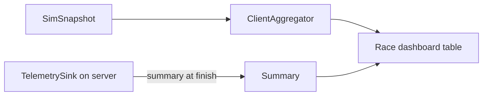
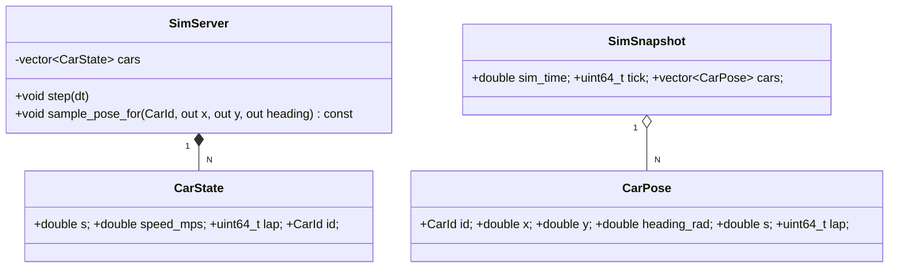
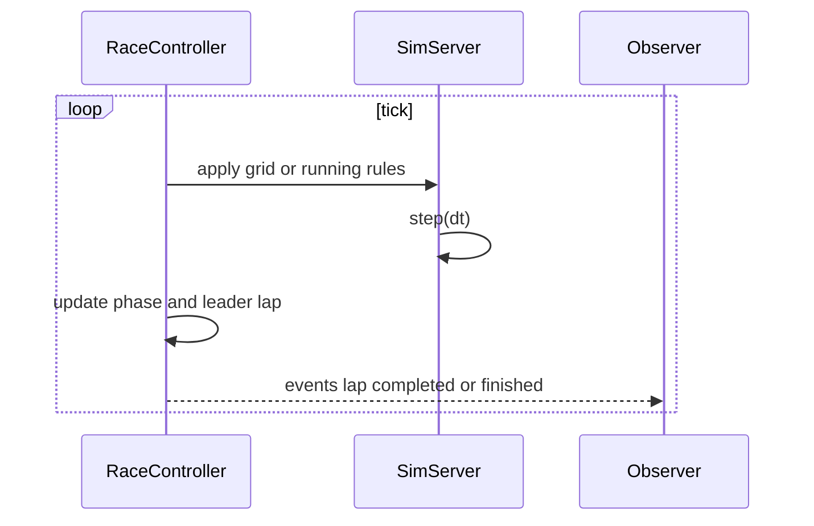

# Roadmap

This roadmap extends the vertical slice with **multiple cars**, an **end to end race**, and a **race dashboard** with statistics. Each milestone is small, test driven, and keeps the client server seam intact.

---

## M1 Multi car simulation core

**Goal**: Simulate N cars in the same world deterministically.

### Scope
- Extend data model:
  - `CarId` (stable identifier)
  - `CarState` per car
  - `SimWorld` inside `SimServer` with `std::vector<CarState>`
- Extend snapshot:
  - `struct CarPose { CarId id; double x; double y; double heading_rad; double s; uint64_t lap; }`
  - `struct SimSnapshot { double sim_time; uint64_t tick; std::vector<CarPose> cars; }`
- Server tick updates all cars.

### API sketch
```cpp
namespace f1tm {
using CarId = uint32_t;

struct CarPose { CarId id; double x; double y; double heading_rad; double s; uint64_t lap; };

struct SimSnapshot {
  double sim_time{};
  uint64_t tick{};
  std::vector<CarPose> cars;
};
}
```

### Tests
- `test_sim_multicar.cpp`: advancing world updates all cars and preserves ids, laps wrap correctly.
- `test_snap_multicar.cpp`: SnapshotBuffer still publishes and client can consume latest.

### Acceptance
- Headless tick processes N cars; no renderer changes yet.

---

## M2 Client interpolation for multiple cars

**Goal**: Interpolate all car poses by `sim_time` on the client thread.

### Scope
- `InterpBuffer` interpolates per car id; clamps if a car has only one sample.
- Maintain capacity per buffer; do not allocate per frame.

### Tests
- `test_interp_multicar.cpp`: per car linear interpolation of position and shortest angle for heading; handles car present or missing between frames.

### Acceptance
- Rendering uses interpolated poses; still identical visuals for N=1.

---

## M3 Viewer renders multiple cars and basic HUD

**Goal**: Draw all cars with simple labels and per car lap count.

### Scope
- Color palette for cars: deterministic by CarId.
- HUD: total cars, current sim time, warp label.

### Acceptance
- With N=8 the app runs smoothly and shows 8 cars moving.

---

## M4 RaceController start to finish

**Goal**: Orchestrate a full race from a grid to checkered flag.

### Scope
- `RaceController` in server thread:
  - Grid setup: positions and initial s per car.
  - Lights out, running, finished states.
  - Lap counter per car, race end when leader reaches target laps.
- Optional future: SC and VSC events integration.

### API sketch
```cpp
namespace f1tm {
struct GridEntry { CarId id; int position; double initial_s; };
struct RaceConfig { int target_laps; std::vector<GridEntry> grid; };
struct RaceState { enum Phase { Grid, Start, Running, Finished } phase; int leader_lap; };

class RaceController {
public:
  explicit RaceController(RaceConfig cfg);
  void tick(double dt, SimServer& sim);
  const RaceState& state() const;
};
}
```

### Tests
- `test_race_controller.cpp`: phase transitions and finish condition for target laps.

### Acceptance
- End to end single process run goes from grid to finished automatically.

---

## M5 Pit stops and lane factors per car

**Goal**: Allow each car to pit, applying pit lane loss and optional SC VSC factors.

### Scope
- Per car pit schedule or triggers.
- Use existing `PitParams`, `Track`, `lane_factors_from_events` to compute losses.
- Server tick applies a short state machine for entering pit, stationary, exit.

### Tests
- `test_pit_runtime.cpp`: a car that pits loses expected time relative to a non pitting car under Green and under SC.

### Acceptance
- Demo: two cars where one pits under SC and gains relative time as expected.

---

## M6 Telemetry and statistics

**Goal**: Collect basic stats for an end of race summary.

### Scope
- Per car aggregates:
  - Total time, best lap time, average lap time
  - Number of pit stops, positions over time
- Lightweight `TelemetrySink` on server thread; immutable `RaceSummary` at finish.

### API sketch
```cpp
namespace f1tm {
struct LapRecord { CarId id; int lap_index; double lap_time; };
struct CarSummary { CarId id; double total_time; double best_lap; double avg_lap; int pit_stops; int finish_position; };
struct RaceSummary { std::vector<CarSummary> cars; };

class TelemetrySink {
public:
  void on_lap(CarId id, int lap_index, double lap_time);
  void on_pit(CarId id);
  RaceSummary finalize(const RaceController& rc) const;
};
}
```

### Tests
- `test_telemetry.cpp`: aggregates match known sequences of laps and pits.

### Acceptance
- End of race logs a concise JSON summary to stdout or file.

---

## M7 Race dashboard

**Goal**: Present all cars with relevant live info.

### Scope
- Client side dashboard panel with a compact per car row:
  - Pos, Id, Gap to leader, Last lap, Best lap, Pit count, Tyre hint (future)
- Sort by race position; update each frame from latest snapshot and a small client side aggregator for gaps.

### Diagram


### Acceptance
- During the race the panel updates every frame. At finish a summary table is shown.

---

## M8 Performance and threading polish

**Goal**: Keep 60 fps render and 240 Hz server with N up to 20 cars.

### Scope
- Avoid dynamic allocations in the hot path.
- Optional sub stepping for high warp values.
- Frame time overlay and simple profiling counters.

### Acceptance
- Smooth visuals at N = 20 on a typical laptop GPU.

---

## M9 Out of process ready

**Goal**: Keep the seam intact so the server can move to a separate process later.

### Scope
- Define a binary or JSON snapshot format with versioning.
- Replace SnapshotBuffer with transport shim while preserving InterpBuffer usage.

---

## Diagrams

### Updated data model for multiple cars


### RaceController high level flow


---

## Notes

- Keep public headers lean and macro safe. Use `<numbers>` for constants.
- Preserve the TDD loop: fail, pass, refactor for each milestone.
